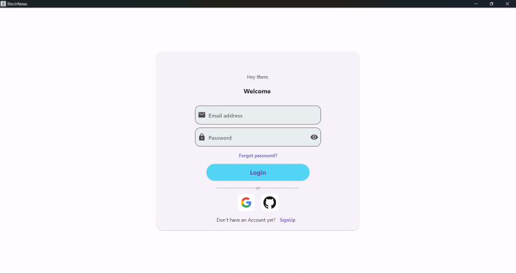
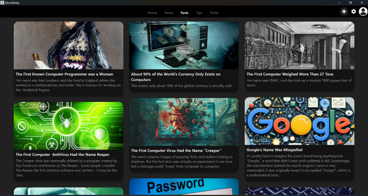

# BtechNews

BtechNews is a comprehensive app designed for B.Tech students, providing them with the latest news, interesting facts, useful tricks, and helpful tips. Stay informed and enhance your academic experience with BtechNews.

## Features

- **Home Screen**: Overview of the latest updates and features.
- **News Section**: Stay updated with the latest news and trends in the tech and engineering world.
- **Facts Section**: Discover interesting and fun facts related to technology and engineering.
- **Tricks Section**: Learn useful tricks to help with your studies and projects.
- **Tips Section**: Get valuable tips to improve your academic performance and career prospects.

## Installation

### For run in Mobile:

 Link: [PlayStore Link](https://play.google.com/store/apps/details?id=com.btechnews.b2)

### For run in Laptop:

File: [Exe File](BtechNews.exe)

### For run in Web:

Link: [Page Url](https:thiruvidhirevanth.github.io/BtechNews)

## Prerequisites

- Flutter SDK: [Install Flutter](https://flutter.dev/docs/get-started/install)
- Dart SDK: Included with Flutter
- Android Studio (for Android builds)
- Visual Studio (for Windows builds)

## Screenshots

 ### Responsive Mobile
 
.png)  .png)  .png) .png) .png) .png)

 ### Responsive Pc & Web

 
  

## Uses

BtechNews can be particularly useful for B.Tech students in the following ways:

1. **Staying Informed**: Keep up with the latest news and trends in technology and engineering, which can be beneficial for coursework, projects, and staying competitive in the field.
2. **Enhancing Knowledge**: Discover fascinating facts and gain deeper insights into various tech topics that can enrich your understanding and spark curiosity.
3. **Improving Skills**: Learn practical tricks and techniques that can assist with coding, problem-solving, and other technical skills essential for B.Tech studies.
4. **Boosting Academic Performance**: Access valuable tips on study strategies, time management, and career advice to excel academically and prepare for future opportunities.
5. **Convenient Access**: Easily access all this information in one app, saving time and effort compared to searching for resources separately.

## License

This project is licensed under the MIT License - see the [LICENSE](LICENSE) file for details.
 
 

 
 

 
